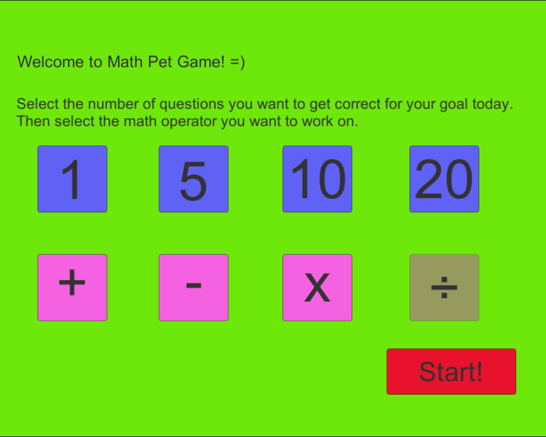
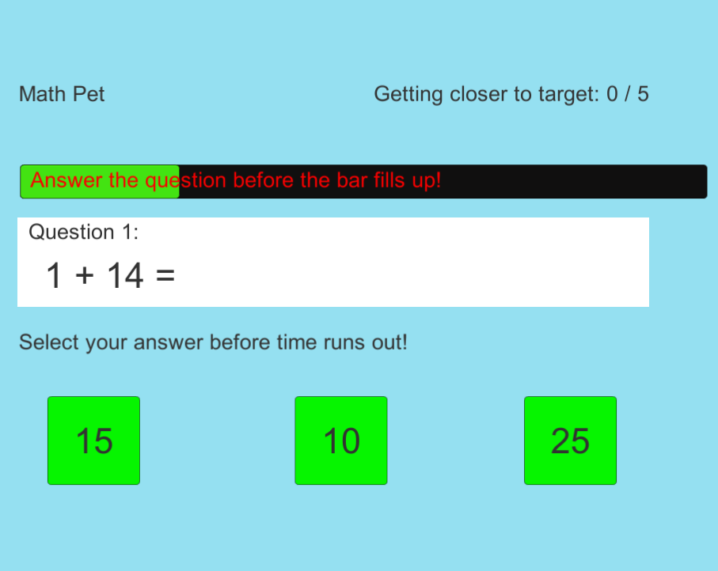
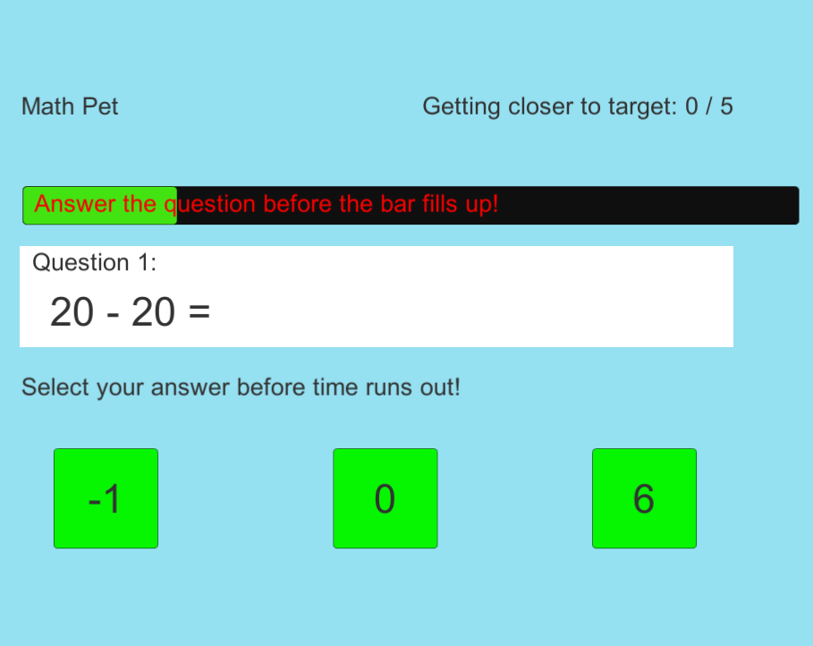
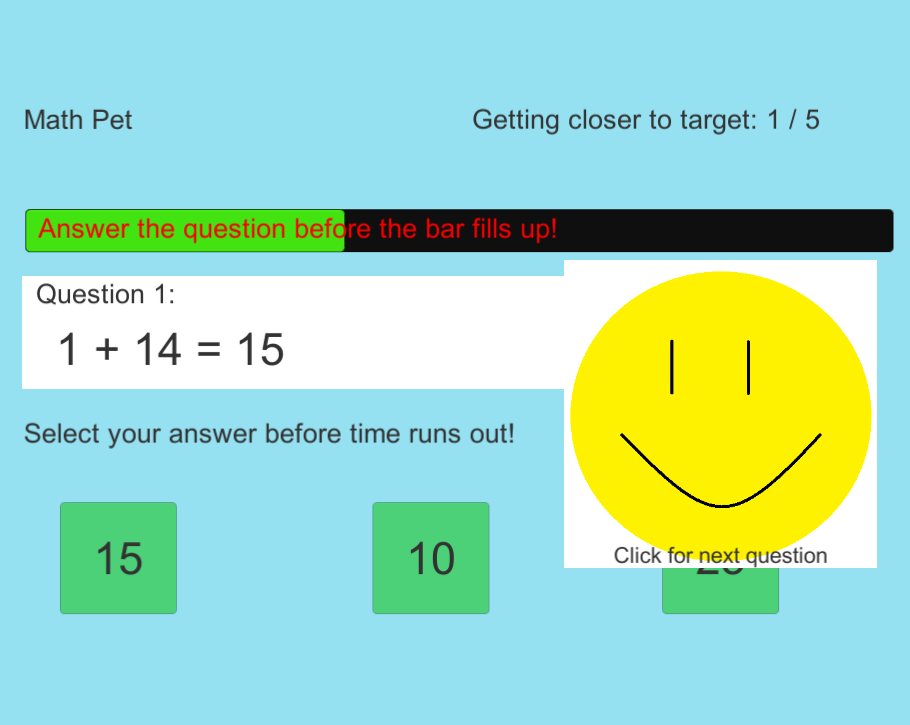
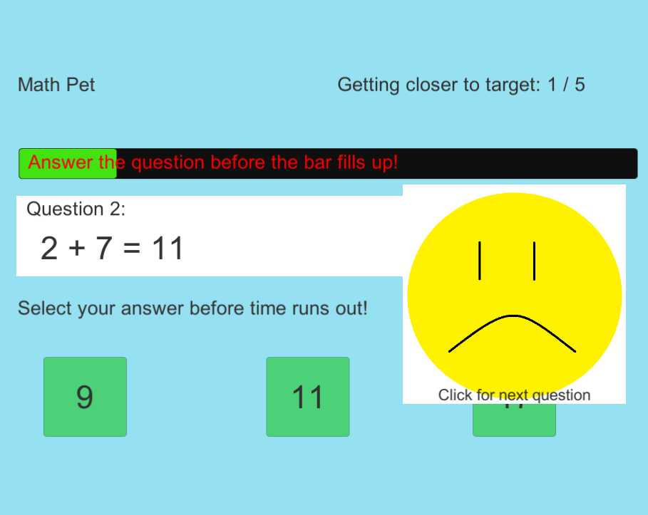
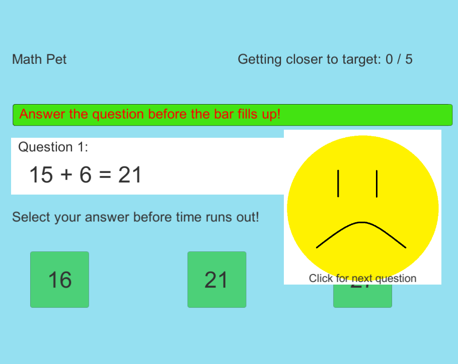
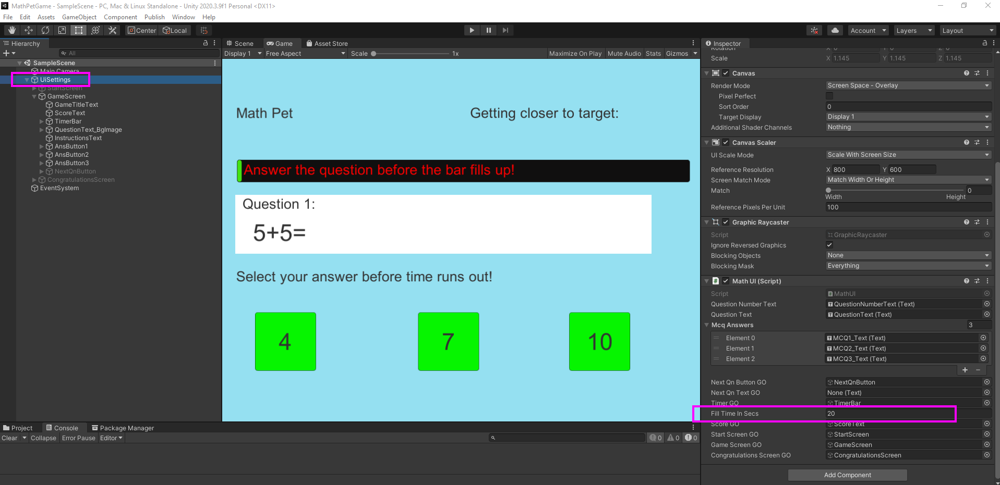
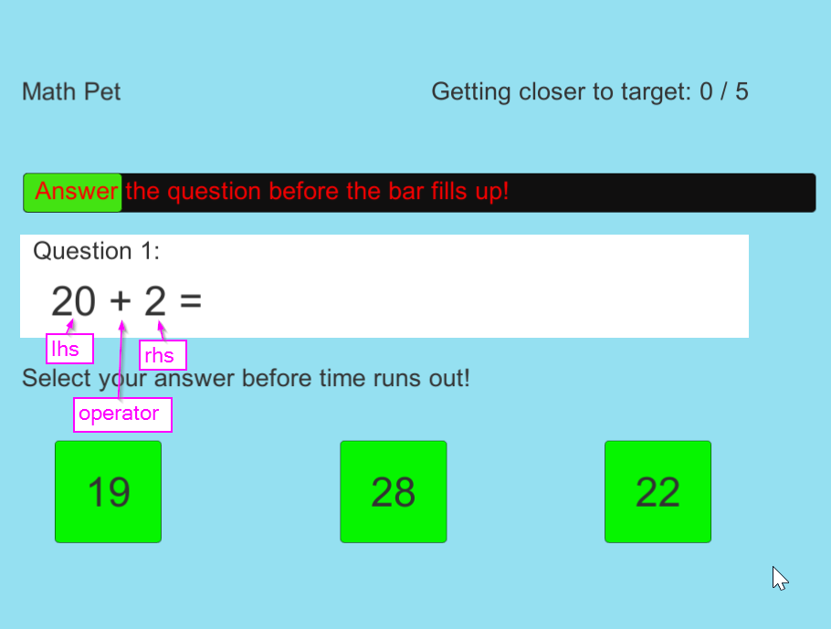

##### by Callista Tan

# MathPetGame

### Overview

Unity C#, math pet game.

* The idea behind this game is that you can set your goal each time you want to play it. Set your own goal of how many questions you would like to answer correctly before the game ends. You will have unlimited tries. The idea is to challenge yourself and to have a growth mindset.

* There will be a timer bar on top of the page for each question. You have to answer the question correctly before the time is up. Otherwise it will be counted as an incorrect answer.

* Addition, Subtraction, Multiplication is currently supported. Division is not yet supported.

1. Starting screen will show you a choice of number of questions and math operations that you would like to attempt in the next mini-game.

2. After selecting the number of questions you would like to answer correctly for this round, select the math operation you would like to work on, then press ***Start!***

3. In game: 
* The number of questions you have answered correctly will be reflected on the top right corner.
* The questions and answers are randomly generated.
* Click on the correct answer before the timer bar fills up.
* Screenshot of the game when addition is selected:
    

4. Screenshot of the game when subtraction is selected:
    

5. Screenshot of the game when multiplication is selected:
    

6. Screenshot of the game when a correct answer is selected:
    

7. Screenshot of the game when a wrong answer is selected:
    

8. Screenshot of the game when time is up:
    

### Customizable Parameters
* Open the SampleScene file in Unity, select ***UiSettings*** game object, and under ***Math UI*** component, you will be able to set the amount of time in seconds for the timer per question under ***Fill Time In Secs***.

Screenshot of the game object and where to edit the timer setting:

* Left hand side number and right hand side number max value can be set in MathQuestionGenerator.cs under ***lhsMaxValue*** and ***rhsMaxValue***.

### How it works
* A random number is selected for both the left hand side (lhs) and right hand side (rhs) value.
* Screenshot showing lhs and rhs in equation:

* The correct answer is dynamically calculated when the question is generated, then the correct answer is placed randomly in choices 1, 2 or 3 so that users will not know the correct answer simply by guessing where the correct answer will appear.
* The answer options are also created based on adding or subtracting from the correct answer by a random value. This is also to prevent the correct answer from appearing to be too obvious.

### Tech Stack
* C#
* Unity